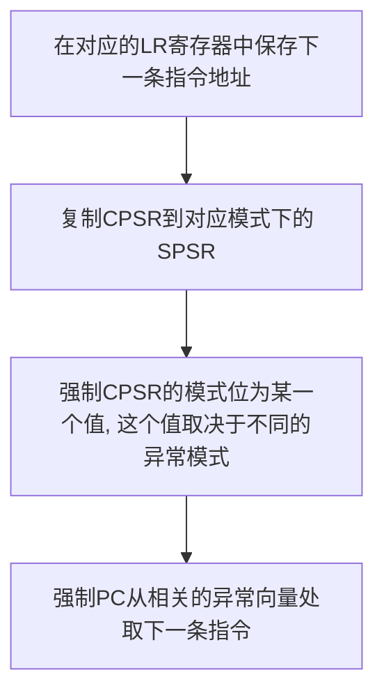
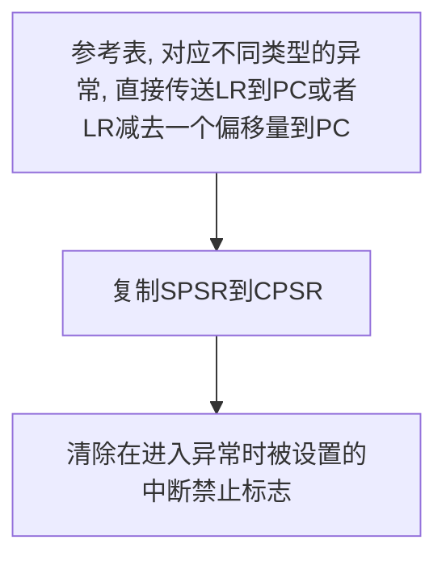
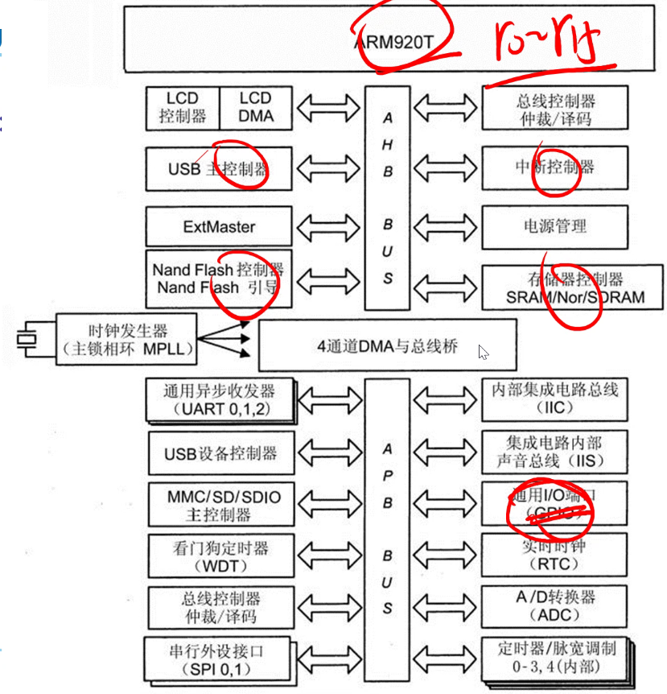

# 第一章

## 嵌入式系统

### 简介

计算机系统分为通用计算机、服务器、嵌入式计算机系统，其各自特点如下

通用计算机

* 通用性强
* 应用面广
* 系统资源充足

服务器

* 大量应用于机房
* 计算能力强，海量的数据处理能力，高吞吐量
* 高耗电、发热

嵌入式计算机系统

* 嵌入到设备中，存在感低
* 功能各异
* 面向应用
* 用于实现设备的部分功能
* 需要从环境中不断获得信息

### 比较


### 定义

以应用为中心、以计算机技术为基础，软硬件可裁剪，适应应用系统对功能、可靠性、成本、体积、功耗等严格要求的专用计算机系统。

### 组成

嵌入式系统由硬件、软件两部分组成。

#### 硬件

1. Micro Processor
2. RAM, ROM
3. I/O ports
4. Networks
5. Timers
6. ······


#### 软件

主流操作系统

* 嵌入式linux
* uC/OS-II
* Windows CE
* VxWorks
* Symbian OS


## 计算机体系结构

从储存结构上来说分为冯诺依曼结构和哈佛结构

哈佛结构（Harvard Architecture)

* 最大特点就是程序和数据分开储存。
* 控制器先读取指令，然后交给运算器解码，得到数据地址，控制器读取数据交给运算器
* 在运算器运算的时候，控制器可以读取下一条指令或者数据。
* 优点1：指令和数据分开存储可以获得较高的执行效率。
* 优点2：分开存储可以使得指令和数据使用不同的位宽。
* 缺点：两套总线，结构复杂，设计复杂度高。


冯·诺依曼结构(Von Neumann Architecture)

* 以数学家John Von Neumann的名字命名，他最早提出了该结构。
* 他认为代码本身也是一种<font color="red">数据</font>。
* 冯·诺依曼结构把计算机分成了<font color="red">运算器、控制器、储存器、输入设备和输出设备</font>5部分。
* 冯·诺依曼结构的工作原理是把让计算机工作的指令储存在储存器内，工作的流程是从储器取指令，由运算器运算指令，控制器根据运算结果处理输入输出设备。
* 优点：结构简单，复杂度低。
* 缺点：数据和指令放在一起，运算器在取
        指令的时候不能同时取数据，运算效率低。


改进的哈弗结构（Enhanced Harvard Architecture）ARM7之后就使用此结构。


## ARM微处理器概述

指令集
CISC vs. RISC

* CISC：Complex Instruction Set Computer
* RISC：Reduced Instruction Set Computer

### CISC(Complex Instruction Set Computer)复杂指令集计算机

* 20世纪90年代广泛使用，具有大量的指令和寻址方式。
* 8/2原则：80%的程序只使用20%的指令。
* 大多数程序只使用少量的指令就能够运行。
* CISC  CPU 包含有丰富的单元电路，因而功能强、面积大、功耗大。

### RISC(Reduced Instruction Set Computer)精简指令集计算机

* 1979年美国加州大学伯克利分校提出了RISC（Reduced Instruction Set Computer，精简指令集计算机）的概念。
* 设计思想，指令规整、对称、简单。
* 指令小于100条，基本寻址方式有2~3种，寻址方式灵活简单，执行效率高。
* 单周期指令。
* 指令字长度一致，单拍完成，便于流水线操作。
* 大量使用寄存器，指令执行速度更快。
* 使CPU硬件结构设计变得更为简单， RISC CPU包含较少的单元电路，因而面积小、功耗低。


### 流水线(Pipeline)技术

优点：提高了CPU的运行效率。-
缺点：内部信息流要求通畅流动。


<font color=red>\*所以后面的异常处理需要进行偏移处理</font>

ARM核心的处理器采用RISC指令集，具有以下的优点：

* 芯片体积小、功耗低、制造成本低、性能优异；
* 支持Thumb（16位）和ARM（32位）两种指令集，8位和16位设备兼容性好；
* 采用RISC，在内部大量使用寄存器，执行指令速度快；
* 大部分的指令都是操作寄存器，只有很少的指令会访问外部内存；
* 采用多久流水线结构处理速度快；
* 支持多种寻址方式，数据存取方式灵活；
* 指令长度固定，便于编译器操作以及执行指令。

### ARM系列处理器核的命名规则


### 结构版本和变异

ARM指令集结构（有些资料也称指令系统）从它最初被开发出来到现在，已经有了非常重要的发展，并且在以后将继续发展。到2006年年底，在所有的ARM实现中存在的指令，已经被定义为多个指令集版本，版本号从1到7。许多版本带有表示变异的字母，用于表示在该版本中收集了指定的附加的指令

* T变异（增加了Thumb指令集）
* M变异（增加了4条长乘、长乘累加指令）
* E变异（增强DSP指令）
* J变异（增加了JAVA加速器）

# 第二章

## S3C2410A微处理器

### 概述

* 16/32位的RISC微处理器芯片
* 内核ARM920T
* 采用了AMBA（Advanced Microcontroller Bus Architecture）总线结构
* AMBA是ARM公司制定的片上总线结构规范，用于ARM核与微处理器芯片内部其他宏单元之间信息传输。
* 1999年推出的AMBA 2.0版本定义了3种总线，AHB,ASB,APB
* 其中ASB（Advanced System Bus）用于连接高性能系统模块，支持突发传输，支持流水线操作。


### 组成框图

## ARM920T

ARM920T核使用了五级流水线。取指、译码、执行、存储（数据缓冲）和回写。
ARM920T支持两种指令集，32位的ARM和16位的Thumb
ARM920T是一款改进哈佛Cache结构的处理器，内部有单独的16KB指令Cache和单独的16KB数据Cache（均为8个字的行长度），指令Cache和数据Cache各自使用单独的地址线和单独的数据线。
ARM920T实现了ARMv4T指令集结构版本

### 特点

ARM920T支持两种指令集，32位的ARM和16位的Thumb。
ARM指令集的主要特点：

* 所有指令都是32位固定长度。
* 在内存中以4字节边界地址对齐保存。
* 只有LOAD-STORE类型指令才可以访问内存。
* 所有的指令都可以条件执行。
* ARM920T使用了桶形（barrel）移位器，可以实现在一个指令周期内完成移位操作和ALU（算术逻辑单元）操作。

Thumb指令集的主要特点：

* 可以在32位结构的ARM920T处理器上运行。
* 比32位ARM指令具有更高的代码密度

### Cache

定义：介于主存和CPU之间的高速小容量存储器

Cache：基于程序访问的局部性原理
局部性原理包括时间局部性和空间局部性。
时间局部性：在同一段时间里有极大的概率访问同一地址的指令和数据。
空间局部性：在程序执行过程中，有极大概率访问相邻空间的指令和数据。

#### 作用

在主存和CPU通用寄存器之间设置一个高速、容量相对较小的存储器。把正在执行的指令地址附近的一部分指令或数据从主存调入这个存储器，供CPU在一定时间内使用。极大的提高程序的运行速度。

<font color=red>不适用场景：对实时性要求高的场景，例如屏幕触控</font>

#### 使用过程（CPU读指令和数据的过程）

Cache只有16KB，而SDRAM有64MB，或者更大。
例：
1：CPU要读取地址A的数据 > CPU以地址A查找cache，刚开始cache无数据（cache miss） >  CPU在内存中读取地址A的数据，并以cache line 32Byte的大小填充cache（cache fill）
2：CPU读取地址A的数据 > cache hit
3：CPU读取地址B的数据 > cache hit
4：CPU读取地址C的数据 > cache 替换

### MMU 内存管理单元（Memory Management Unit）

负责虚拟地址到物理地址的映射

作用：

* 让应用程序以相同的链接地址来编译
* 可以使大容量的应用程序在资源少的系统上运行
* 提供硬件机制的内存访问权限检查
* 现在的多用户多进程操作系统通过MMU使得各用户进程拥有自己独立的地址空间（地址映射功能使得各进程“看起来”拥有一样的地址空间，而访问权限检查可以保护每个进程所用的内存不会被其他进行破坏）

## ARM920T开发

### 储存器格式

ARM920T允许使用大端、小端储存器格式。可以对储存在储存器中的字以大端或者小端格式访问

大端模式高地址存的是数据的低位，低地址存存的是数据的高位。小端模式高地址存的是数据的高位, 低地址存的是数据的地位


### 数据类型

三种数据类型：

* 字，32位，以4字节为边界对齐存取
* 半字，16位，以2字节为边界对齐存取
* 字节，8位，使用任意字节地址存取

### 两种操作状态

ARM状态：在这种状态执行32位长度的、字边界对齐的ARM指令；
Thumb状态：在这种状态执行16位长度的、半字边界对齐的Thumb指令。

ARM状态与Thumb状态之间的切换，实现高效和储存器带宽受限，代码密度要求较高的应用场景。

ARM指令集的主要特点：

* 所有指令都是32位固定长度，便于译码和流水线实现；
* 使用了桶形移位器，可以在一个指令周期内完成移位操作和ALU（算术逻辑）操作。

Thumb指令集的主要特点：

* 典型的Thumb代码规模是ARM代码的65%，并且当正在运行的代码是从一个16位数据总线的储存器读出时，Thumb代码的效率是ARM代码的60%；
* 因此Thumb代码更适合于储存器带宽受限，并且代码密度要求较高的嵌入式应用方案。

### 操作状态转换

使用ARM指令集的BX指令、并且BX指令指定寄存器的bit[0]=1，能够从ARM状态进入到Thumb状态；
使用Thumb指令集的BX指令、并且BX指令指定寄存器的bit[0]=0，能够从Thumb状态进入到ARM状态。
无论处理器在ARM状态或Thumb状态，发生了异常，进入异常处理程序处理器一定是在ARM状态。
如果一个异常在Thumb状态出现，处理器要转换到ARM状态，异常处理完返回时自动转换回Thumb状态。
刚进入异常处理程序后处理器处在ARM状态，如果需要，异常处理程序能够转换到Thumb状态，但是异常处理程序结束前，处理器必须转换到ARM状态。
在ARM状态才允许异常处理程序正确的终止。

### 操作模式


### 寄存器

ARM920T共有<font color=red>37</font>个寄存器；
其中<font color=red>31个通用寄存器，6个状态寄存器</font>
所有寄存器都是32 bit。
31个通用寄存器主要与ALU进行数据交换。
使用load/store指令与储存器进行数据交换


LR：下一条指令地址

PC：程序计数器

CPSR：当前状态寄存器

SPSR：程序状态保存寄存器

状态切换时切换后对于切换前未使用的寄存器无需保存


### 异常处理

#### 进入



#### 退出




Q：为什么要进行偏移？

A：因为流水线处理方式，各个处理单元执行的指令单元不一样

Q：为什么要清除中断禁止标记

A：因为异常处理相当于一种临界区，处理完毕后需要解除占用

# 第三章

## ARM指令集概述

### 指令分组

* 分支指令：转移或者跳转指令，可以向小地址和大地址进行分支，可以分支到子程序，也可以使用分支指令实现处理器状态切换
* 数据处理指令：对通用寄存器中的数据进行操作，不允许使用储存器
* 状态寄存器访问指令：用于访问状态寄存器 CPSR SPSR
* 单个寄存器装入或存储指令：从储存器装入字、半字、字节数据到寄存器；保存寄存器的值到寄存器
* 块数据装入或存储指令：从储存器装入数据到通用寄存器组的全部或部分；保存通用寄存器组的全部或部分寄存器内容到储存器
* 协处理器指令：支持储存器/寄存器与协处理器的寄存器进行数据传输

<font color=red>数据处理指令仅能处理寄存器中的数据，处理结果仍要放回寄存器中，而对系统存储器的访问则需要通过专门的Load/Store指令来完成</font>

### 指令能力

条件执行：所有ARM指令均可以在指令操作码助记符后，跟随一个条件码助记符后缀，依据CPSR中条件码标志，有条件的执行

寄存器访问：在ARM状态下，所有指令能够访问R0~R14，大部分指令也允许访问R15；MRS和MSR指令能访问CPSR、SPSR和通用寄存器

对在线式桶形移位器（barrel shifter）的访问：ARM结构的逻辑单元有一个32位的桶形移位器，可以实现一般移位和循环移位

### 指令编码格式

只需记住一个


#### 条件域

在ARM状态，所有指令都要根据CPSR中的条件码标志和指令中条件域指定的内容，有条件地执行

[31：28] (N Z C V) 确定在哪一种情况下这条指令被执行，如果N、Z、C、V标志的状态满足指令中条件域编码要求，指令被执行，否则指令被忽略。

有15种可能的条件，每一种由2个字符代替，称为条件码助记符后缀（简称条件码助记符），可以附加在指令助记符后


> N、Z、C、V，最高4位称为条件码标志。ARM的大多数指令可以条件执行的，即通过检测这些条件码标志来决定程序指令如何执行。
>
> 各个条件码的含义如下：
>
> N：在结果是有符号的二进制补码情况下，如果结果为负数，则N=1；如果结果为非负数，则N=0。
>
> Z：如果结果为0，则Z=1;如果结果为非零，则Z=0。
>
> C：其设置分一下几种情况：
>
> 对于加法指令（包含比较指令CMN），如果产生进位，则C=1;否则C=0。
>
> 对于减法指令（包括比较指令CMP），如果产生借位，则C=0;否则C=1。
>
> 对于有移位操作的非法指令，C为移位操作中最后移出位的值。
>
> 对于其他指令，C通常不变。
>
> V：对于加减法指令，在操作数和结果是有符号的整数时，如果发生溢出，则V=1;如果无溢出发生，则V=0;对于其他指令，V通常不发生变化。

#### 控制位

终端控制 处理器模式的切换

T 状态位 指示处于ARM状态还是Thrum状态

#### 模式位

4-0

### 指令汇编格式

```assembly
<opcode>{<cond>}{S} <Rd>,<Rn>{,<op2>}
CMP R0,R1
;R0与R1比较
ADDHI R0,R0,#1
;若R0>R1，则R0=R0+1
ADDLS R1,R1,#1
;若R0≤R1，则R1=R1+1
```

`条件码 - 指令码 - 目的寄存器 - 操作数1寄存器 - 操作数2`

其中，< >内的项是必需的，{ }内的项是可选的
上述指令格式中的opcode、cond 与S 之间没有分隔符
S 与Rd 之间用空格隔开

对于其中的 `op2` 操作数灵活使用能够提高代码效率，其使用有三种形式

* #immed_8r——常数表达式
* Rm——寄存器方式
* Rm,shift——寄存器移位方式

#### #immed_8r

0-7 立即数 8-11 位移数

该常数必须对应8位位图，即必须是一个8位的常数通过循环右移偶数位可以得到的数。

机器码对应值右移 2*位移的数值次 后的到程序员设定的值

f(x)=2*x

位移对应0=0=32 2=4 3=6 4=8

对于不符合该规则的存地址，执行时去寄存器取值

立即数 加快指令执行

#### Rm 寄存器方式

在寄存器方式下，操作数即为寄存器的数值

#### Rm 寄存器Rm移位

将就差你起的位移结果作为操作数，Rm值保持不变

### SBC指令

减法运算中出现借位C为0 无借位为1

+S为更新CPSR的C标志位

# 第四章

## 汇编语言


汇编语言并不能被机器所识别，而是通过编译器将指令转译为对应的二进制操作码从而被机器执行。

在ARM汇编中，一些特殊的指令助记符没有对应的操作码，而这些助记符成为伪指令，完成的操作伪操作，伪指令分为三类：通用指示符，与ARM指令相关的伪指令，与Thumb指令相关的伪指令

## 通用指示符

通用指示符包括：

* 符号定义指示符
* 数据定义指示符
* 汇编控制指示符
* 其他常用指示符

### 语法规则

* {符号} {指令|指示符|伪指令} {;注释}
大括号括起来的三部分是可选的
* 符号symbol必须从第一列开始，不能含有任何其他字符，包括空格或Tab
* 如果一行中没有符号symbol，那么指令|指示符|伪指令不能从第一列位置开始写，前面必须放置空格或Tab
* 每一条指令的助记符可以使用全部大写或全部小写字母，但不能大、小写混用
* 指示符必须大写
* 指令中每一个寄存器名都能够全部大写或全部小写，但不能大、小写混用

伪指令在源程序中的作用：

既要把正常的程序用指令表达给计算机，又要把程序设计者的意图、逻辑表达给编译器

### 符号定义伪指令

符号定义指示符包括<font color=red>声明并初始化变量</font>指示符、<font color=red>设置变量值</font>指示符和一些其他指示符

#### 全局变量

| 指示符 | 功能 |
| :--- | :--- |
| GBLA| 声明一个全局算术变量并初始化为0 |
| GBLL| 声明一个全局逻辑变量并初始化为FALSE |
| GBLS| 声明一个全局字符串变量并初始化为NULL |

对于全局变量来说，变量名是唯一的

#### 局部变量

| 指示符 | 功能 |
| :--- | :--- |
| LCLA| 声明一个局部算术变量并初始化为0 |
| LCLL| 声明一个局部逻辑变量并初始化为FALSE |
| LCLS| 声明一个局部字符串变量并初始化为NULL |

#### 设置变量值

| 指示符 | 功能 |
| :--- | :--- |
| SETA| 设置一个算术变量的值 |
| SETL| 设置一个逻辑变量的值 |
| SETS| 设置一个字符串变量的值 |

#### 其它指示符

| 指示符 | 功能 |
| :--- | :--- |
| RLIST| 声明一个寄存器列表 |
| CN | 为协处理器寄存器定义名称 |
| CP | 为指定的协处理器定义名称 |
| EQU | 定义一个常量 |
| EXPORT | 声明一个全局符号 |
| GLOBAL | 声明一个全局符号 |
| FN | 为指定的浮点寄存器定义名称 |
| IMPORT | 声明其它文件定义的符号 |
| EXTRN | 声明其它文件定义的符号 |
| KEEP | 声明一个符号不被优化器优化，保留局部符号 |
| RN | 为指定的通用寄存器定义名称 |

### 数据定义伪指令

数据定义伪指令一般用于为特定的数据分配存储单元，同时可完成已分配存储单元的初始化。

| 指示符 | 功能 |
| :--- | :--- |
| DATA | 定义一个数据段 |

# 第六章

## GPIO端口

x为A-J

* GPxCON: <font color=red>选择引脚功能</font>
* GPxDAT:  <font color=red>读/写</font>引脚数据
* GPxUP: 确定是否使用<font color=red>内部上拉电阻</font>

## GPxCON寄存器

### 功能

用于配置，即选择引脚功能

## GPxDAT

### 功能

用于读写引脚状态

被设为输出时，写寄存器对于位可令其输出高低电平

设为输入时，可读取对应寄存器获取高低电平状态

## 访问单个引脚

3种情况: 输出高低电平、检测输入引脚状态、中断

一般通过读写寄存器完成

**对于特殊功能寄存器的访问是以内存的形式的进行的**

因为R0-R15在CPU中，而特殊功能寄存器在控制器中


