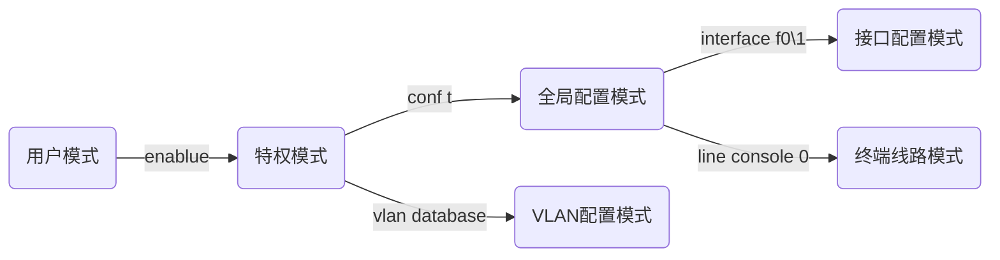
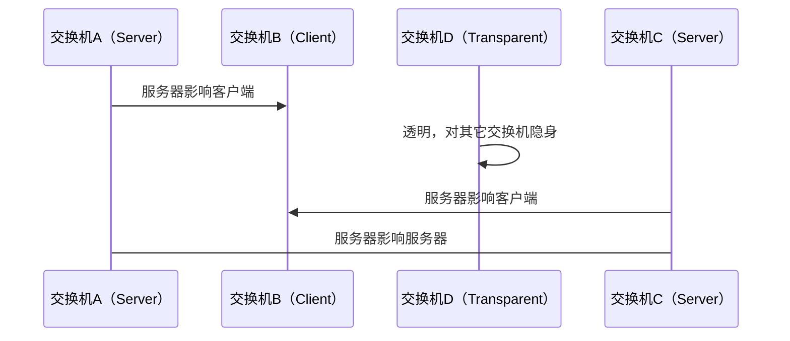

# 第一章 计算机网络仿真概述

略

# 第二章 线缆和计算机的仿真

## 接口

| 名称      | 功能         |
| --------- | ------------ |
| console口 | 配置口       |
| RS-232    | 串口通信接口 |

## 线缆

### 直连线（直通线）

两端线序相同，同为568A或568B


### 交叉线

两端接线方法相异，一端为568A另一端为568B


### 线缆的选择

根据引脚定义选择，例如个人电脑使用引脚1、2发送数据，集线器使用引脚1、2接受数据，选择直通线


|    设备    | 引脚1、2定义 |
| :--------: | :----------: |
|    电脑    |     发送     |
|   路由器   |     发送     |
| 无线接入点 |     发送     |
|   集线器   |     接收     |
|   交换机   |     接收     |

| 设备1                  | 设备2                | 线缆选择 |
| ---------------------- | -------------------- | -------- |
| 电脑                   | 集线器               | 直通线   |
| 集线器、交换机uplink口 | 交换机、集线器普通口 | 直通线   |
| 集线器、交换机         | 路由器LAN口          | 直通线   |
| 电脑                   | 电脑                 | 交叉线   |
| 集线器、交换机普通口   | 集线器、交换机普通口 | 交叉线   |
| 路由器LAN口            | 路由器LAN口          | 交叉线   |
| 路由器WAN口            | 电脑                 | 交叉线   |

总结：看两端对引脚1、2定义，两端同为发或收时使用交叉线

### Packet tracer线缆两端灯亮点的含义

| 颜色   | 含义                                        |
| ------ | ------------------------------------------- |
| 绿色   | 物理连接准备就绪，还没有Line Protocol的指示 |
| 绿色闪 | 连接激活                                    |
| 红色   | 物理连接不通，没有信号                      |
| 黄色   | 交换机端口处于“阻塞”状态                    |

## 自定义模块

| 名称            | 作用                                                         |
| --------------- | ------------------------------------------------------------ |
| Linksys-WMP300N | 提供2.4GCHZ无线接口用于连接无线网络，支持采用以太网方式的LAN接入协议 |
| PT-HOST-NM-1AM  | 提供2个RJ-11连接器，以满足基本电话服务链接需要               |
| PT-HOST-NM-1CE  | 提供一个以太网端口，该端口可以连接一个局域网核心             |
| PT-HOST-NM-1CFE | 提供一个支持铜介质的快速以太网接口                           |
| PT-HOST-NM-1CGE | 提供一个支持铜介质的1000兆以太网接口                         |
| PT-HOST-NM-1FFE | 提供一个快速以太网接口，介质是光纤                           |
| PT-HOST-NM-1FGE | 提供千兆光纤连接用于连接路由器                               |
| PT-HOST-NM-1W   | 提供一个2.4GHZ无线接口用于连接无线网络，支持采用以太网方式的 LAN接入协议 |
| PT-HOST-NM-1W-A | 提供一个5GHz的无线接口,用于连接到无线802.11a网络             |

## DTE和DCE

线缆一样，根据名字定义先点的是什么，例如DCE线缆先点的是DCE

DCE（数据通信设备或者数据电路终端设备）：该设备和其与通信网络的连接构成了网络终端的用户网络接口。它提供了到网络的一条物理连接、转发业务量，并且提供了一个用于同步DCE设备和DTE设备之间数据传输的时钟信号。调制解调器和接口卡都是DCE设备的例子。

DTE（数据终端设备）：指的是位于用户网络接口用户端的设备，它能够作为信源、信宿或同时为二者。数据终端设备通过数据通信设备（例如，调制解调器）连接到一个数据网络上，并且通常使用数据通信设备产生的时钟信号。数据终端设备包括计算机、协议翻译器以及多路分解器等设备。

## 交换机

| 名称      | 功能                                           |
| --------- | ---------------------------------------------- |
| 2950-24   | 24口交换机，二层交换机                         |
| 3560-24PS | 三层交换机，可以转发数据包，拥有部分路由器功能 |
| 网桥      | 中续                                           |

# 第三章 集线器及交换机的基本配置仿真

## 四种配置方法

* 基于CLI
* 基于Console
* 基于Config窗口
* 基于Telnet

## 交换机命令

*** *[]表示为参数***

| 命令 | 模式   | 作用                         |
| ---- | ------ | ---------------------------- |
| ?    | 无要求 | 查看能够使用的命令或补全建议 |
| show | 无要求 | 输出信息                     |
| exit | 无要求 | 退出当前模式                 |

## 工作模式

用户模式:  `Switch>`

特权模式:  `Switch#` 

全局配置模式:  `Switch(config)#`

接口模式:  `Switch(config-if)#`

VLAN模式:  `Switch(vlan)#`

终端线路模式:  `Switch(config-line)#`



## 命令

### 用户模式 <font color=gray size=5>Switch></font>

| 命令   | 说明         |
| ------ | ------------ |
| enable | 进入特权模式 |

### 特权模式  <font color=gray size=5>Switch#</font>

| 命令                               | 说明                                               |
| ---------------------------------- | -------------------------------------------------- |
| configure terminal                 | 进入全局配置模式                                   |
| no ip domain-lookup                | 禁用交换机的DNS服务                                |
| vlan database                      | 配置VLAN配置模式                                   |
| show vlan                          | 输出vlan列表                                       |
| show running-config                | 查看当前的运行配置文件，可以查看password设置的密码 |
| show interface                     | 显示接口信息                                       |
| show mac-address-table             | 查看交换机的MAC地址                                |
| show startup-config                | 显示启动配置文件                                   |
| copy running-config startup-config | 复制运行配置到启动配置                             |
| write memory                       | 运行配置写到启动配置                               |
| show history                       | 输出历史使用命令                                   |

### 接口模式  <font color=gray size=5>Switch(config-if)#</font>

| 命令                                 | 说明                     |
| ------------------------------------ | ------------------------ |
| ip address 192.168.1.2 255.255.255.0 | 配置接口IP地址和子网掩码 |
| shutdown                             | 关闭接口                 |
| no shutdown                          | 启用接口                 |
| duplex [full/half/auto]              | 设为全双工/半双工/自动   |
| speed [10/100]                       | 设置速度为10M/100M       |
| description [content]                | 设置接口描述             |
| switchport mode access               |                          |
| switchport access vlan 1             | 加入到vlan1中            |

### 全局配置模式 <font color=gray size=5>Switch(config)#</font>

| 命令                           | 说明                                   |
| ------------------------------ | -------------------------------------- |
| no ip domain-lookup            | 禁用域名解析服务                       |
| ip domain-lookup               | 启用域名解析服务                       |
| enable password [pw]           | 设置一个明文密码，可以在配置文件中看到 |
| enable secret [pw]             | 设置一个加密密码，优先级比password高   |
| ip default-gateway 192.168.0.1 | 设置默认网关                           |
| hostname                       | 更改名称                               |
| no hostname                    | 恢复默认名称                           |
| line console [ID]              | 终端线路模式                           |
| ip name-server x.x.x.x         | 设置DNS服务器的IP                      |
| ip host chuangye x.x.x.x       | 设置域名与IP关联                       |
| interface f0\1                 | 进入f0\1的接口配置模式                 |
| interface vlan 1               | 进入vlan的接口配置模式                 |

### VLAN配置模式 <font color=gray size=5>Switch(vlan)#</font>

| 命令                  | 说明                           |
| --------------------- | ------------------------------ |
| vlan [id] name [name] | 创建一个编号为[ID]名称为[name] |
| no vlan [id]          | 删除编号为[ID]的vlan           |

### 终端线路模式 <font color=gray size=5>Switch(config-line)#</font>


## 配置交换机的telnet登录模式

### 配置交换机

1. 把配置交换机和交换机使用配置线连接起来
2. 为交换机配置管理IP地址
3. 配置交换机的telnet登录方式
4. 配置交换机的特权密码 enable password
5. 登录的计算机要和交换机在同一网段，且网关地址设置为交换机的IP管理地址

### 配置计算机

1. 设置IP地址为192.168.1.2
2. telnet 192.168.1.1

```shell
Switch>enable
Switch#conf t
Enter configuration commands, one per line.  End with CNTL/Z.
Switch(config)#int vlan 1
Switch(config-if)#ip address 192.168.1.1 255.255.255.0
Switch(config-if)#no shutdown

Switch(config-if)#
%LINK-5-CHANGED: Interface Vlan1, changed state to up

%LINEPROTO-5-UPDOWN: Line protocol on Interface Vlan1, changed state to up

Switch(config-if)#exit
Switch(config)#line vty 0 4
Switch(config-line)#password  123456
Switch(config-line)#login
Switch(config-line)#end
Switch#
%SYS-5-CONFIG_I: Configured from console by console

Switch#config t
Enter configuration commands, one per line.  End with CNTL/Z.
Switch(config)#enable password 888888
Switch(config)#end
Switch#
```

## 链路聚合

channel-group 1 mode ?

参数说明:

| 值        | 说明                                                         |
| --------- | ------------------------------------------------------------ |
| active    | Enable LACP unconditionally  主动发送LACP报文                |
| auto      | Enable PAgP only if a PAgP device is detected   被动发送PAgP报文 |
| desirable | Enable PAgP unconditionally  主动发送PAgP报文                |
| on        | Enable Etherchannel only   手动设置，需要两边都设置成on      |
| passive   | passive  Enable LACP only if a LACP device is detected  被动接收LACP报文 |


* active: 主动发送LACP报
* auto: 被动，只会接收协商消息
* desirable: 主动，会发送也会接收协商消息
* on: 强行起etherchannel，手动设置，需要两边都设置成on
* passive: 同auto

port-channel load-balance [param]

* src-dst-mac

* src-dst-ip

* src-mac

* src-ip

* dst-mac

* dst-ip

结构说明：

* src: 源
* dst: 目标
* ip: 根据IP
* mac:  根据MAC

### 端口聚合操作过程

Switch0:

```shell
Switch>enable
Switch#conf t
Enter configuration commands, one per line.  End with CNTL/Z.
Switch(config)#port-channel load-balance src-dst-mac
Switch(config)#int range f0/1-3
Switch(config-if-range)#channel-protocol lacp (思科专有协议，pagp)
Switch(config-if-range)#channel-group 1 mode active
Switch(config-if-range)#
Creating a port-channel interface Port-channel 1

%LINEPROTO-5-UPDOWN: Line protocol on Interface FastEthernet0/1, changed state to down

%LINEPROTO-5-UPDOWN: Line protocol on Interface FastEthernet0/1, changed state to up

%LINEPROTO-5-UPDOWN: Line protocol on Interface FastEthernet0/2, changed state to down

%LINEPROTO-5-UPDOWN: Line protocol on Interface FastEthernet0/2, changed state to up

%LINEPROTO-5-UPDOWN: Line protocol on Interface FastEthernet0/3, changed state to down

%LINEPROTO-5-UPDOWN: Line protocol on Interface FastEthernet0/3, changed state to up

Switch(config-if-range)#
```

Swith1:

```shell
Switch>en
Switch#conf t
Enter configuration commands, one per line.  End with CNTL/Z.
Switch(config)#port-channel load-balance src-dst-mac
Switch(config)#int range f0/1-3
Switch(config-if-range)#channel-protocol lacp
Switch(config-if-range)#channel-group 1 mode active
Switch(config-if-range)#
Creating a port-channel interface Port-channel 1

%LINEPROTO-5-UPDOWN: Line protocol on Interface FastEthernet0/1, changed state to down

%LINEPROTO-5-UPDOWN: Line protocol on Interface FastEthernet0/1, changed state to up

%LINEPROTO-5-UPDOWN: Line protocol on Interface FastEthernet0/2, changed state to down

%LINEPROTO-5-UPDOWN: Line protocol on Interface FastEthernet0/2, changed state to up

%LINEPROTO-5-UPDOWN: Line protocol on Interface FastEthernet0/3, changed state to down

%LINEPROTO-5-UPDOWN: Line protocol on Interface FastEthernet0/3, changed state to up

%LINK-5-CHANGED: Interface Port-channel 1, changed state to up

%LINEPROTO-5-UPDOWN: Line protocol on Interface Port-channel 1, changed state to up

Switch(config-if-range)#
```


参考资料:

[Cisco交换机端口聚合(EtherChannel)](https://www.cnblogs.com/zoulongbin/p/6654545.html)


### 端口通道

channel-protocol lacp pagp

show etherchannel summary  列出聚合端口协议

show etherchannel port-channel 列举某些聚合端口

### 端口安全 port security config-if

switchport mode access 接口改为接入模式

switchport port-security 打开该端口的端口安全功能

switchport port-security maximum n 设置端口安全地址的最大个数  1-128

switchport port-security mac-address x.x.x.x [ip-address y.y.y.y] 安全地址绑定


switchport port-security violation ?

安全违例处理方式

protect 当安全地址个数满后 安全端口将丢弃未知地址的帧（默认）

restrict 违反端口安全时，发送Trap通知

shutdown 当违反时关闭对应端口并发送一个Trap通知

聚合端口不能设置安全违例

# 第四章 局域网及相关技术仿真

## 老化时间

作用：到达老化时间而未刷新时，此条条目会从ARP缓存表中删除。在老化时间之内，如果收到arp请求报文或者响应报文且存入此条条目，就会刷新senderIP对应的条目，更新mac地址项（用senderMAC，不管是否相同），且重置老化时间timeout

Switch(config-if)# switchport port-security aging static time [] 单位分钟 默认0

show port-security int f0/1

```
Switch(config-if)#switchport port-security
Command rejected: FastEthernet0/1 is a dynamic port.
Switch(config-if)#switchport mode access
Switch(config-if)#switchport port-security
Switch(config-if)#switchport port-security maximum 1
Switch(config-if)#switchport port-security mac-address 0090.0C86.0127
Switch(config-if)#no shutdown
Switch(config-if)#
Switch(config-if)#int vlan 1
Switch(config-if)#ip address 192.168.1.1 255.255.255.0
Switch(config-if)#ex
Switch(config)#ex
Switch#
%SYS-5-CONFIG_I: Configured from console by console

Switch#show port-security int f0/1
Port Security              : Enabled
Port Status                : Secure-up
Violation Mode             : Shutdown
Aging Time                 : 0 mins
Aging Type                 : Absolute
SecureStatic Address Aging : Disabled
Maximum MAC Addresses      : 1
Total MAC Addresses        : 1
Configured MAC Addresses   : 1
Sticky MAC Addresses       : 0
Last Source Address:Vlan   : 0000.0000.0000:0
Security Violation Count   : 0
```

## 跨交换机的内部访问

```shell
Switch>en
Switch#conf t
Switch(config)#int f0/1
Switch(config-if)#switchport mode access
Switch(config-if)#switchport access vlan 100
```

使用上述命令过程将链路绑定到VLAN后，两台同VLAN域的机器可互相通信

对于两个交换机连接的端口需要设置 `switchport mode trunk` 

## 聚合端口

vtp mode trunk

可以设置一条链路绑定多个vlan

## VTP域

Switch出于三种VTP模式之一

| 模式        | 说明                                                         |
| ----------- | ------------------------------------------------------------ |
| server      | 服务器模式                                                   |
| client      | 客户模式                                                     |
| transparent | 透明模式，会接收别人的VTP数据但不会更新自己，也不会向外发送VTP数据 |

VTP设置

| 命令                                 | 说明                |
| ------------------------------------ | ------------------- |
| vtp domain XXX                       | 设置自己所处的VTP域 |
| vtp mode server\|client\|transparent | 全局模式下用        |
| vtp server\|client\|transparent      | vlan模式下用        |
| show vtp status                      | 输出vtp状态         |

\*VTP传输的数据必须在Trunk端口或链路上走



VTP域设置后，需要设置hostname才能同步

## VLAN帧的放行策略

帧区别

| ISL          | IEEE802.1Q           |
| ------------ | -------------------- |
| CISO私有协议 | 工业通用标准         |
| 头尾加数据   | 插入数据，不破坏原帧 |

命令

| 命令                                   | 说明                    |
| -------------------------------------- | ----------------------- |
| switchport trunk allowed vlan remove X | 禁止编号X的vlan通过     |
| switchport trunk allowed vlan add X    | 运行编号X的vlan通过     |
| switchport trunk allowed vlan all      | 允许所有vlan通过        |
| switchport trunk allowed vlan except X | 除了X其他的vlan允许通过 |
| show interface trunk                   | 输出端口信息            |

交换机1：

```shell
Switch>en
Switch#conf t
Enter configuration commands, one per line.  End with CNTL/Z.
Switch(config)#vtp mode server
Device mode already VTP SERVER.
Switch(config)#int f0/10
Switch(config-if)#switchport mode trunk

Switch(config-if)#
%LINEPROTO-5-UPDOWN: Line protocol on Interface FastEthernet0/10, changed state to down

%LINEPROTO-5-UPDOWN: Line protocol on Interface FastEthernet0/10, changed state to up

Switch(config-if)#ex
Switch(config)#vtp domain Chuangye
Domain name already set to Chuangye.
Switch(config)#ex
Switch#
%SYS-5-CONFIG_I: Configured from console by console

Switch#vlan database
% Warning: It is recommended to configure VLAN from config mode,
  as VLAN database mode is being deprecated. Please consult user
  documentation for configuring VTP/VLAN in config mode.
	
Switch(vlan)#vlan 10
VLAN 10 added:
    Name: VLAN0010
Switch(vlan)#vlan 15
VLAN 15 added:
    Name: VLAN0015
Switch(vlan)#vlan 20
VLAN 20 added:
    Name: VLAN0020
Switch(vlan)#vlan 25
VLAN 25 added:
    Name: VLAN0025
Switch(vlan)#ex
APPLY completed.
Exiting....
Switch#conf t
Enter configuration commands, one per line.  End with CNTL/Z.
Switch(config)#int f0/1
Switch(config-if)#switchport mode access
Switch(config-if)#switchport access vlan 10
Switch(config-if)#int f0/2
Switch(config-if)#switchport mode access
Switch(config-if)#switchport access vlan 15
Switch(config-if)#int f0/3
Switch(config-if)#switchport mode access
Switch(config-if)#switchport access vlan 20
Switch(config-if)#int f0/4
Switch(config-if)#switchport mode access
Switch(config-if)#switchport access vlan 25
Switch(config-if)#ex
Switch(config)#ex
Switch#conf t
Enter configuration commands, one per line.  End with CNTL/Z.
Switch(config)#int f0/10
Switch(config-if)#switchport trunk allowed vlan remove 10
Switch(config-if)#switchport trunk allowed vlan add 10
```

交换机2：

```shell

Switch>
Switch>ebn
Translating "ebn"...domain server (255.255.255.255)
% Unknown command or computer name, or unable to find computer address

Switch>
Switch>en
Switch#conf t
Enter configuration commands, one per line.  End with CNTL/Z.
Switch(config)#int f0/10
Switch(config-if)#switchport mode trunk
Switch(config-if)#ex
Switch(config)#vtp domain Chuangye
Changing VTP domain name from NULL to Chuangye
Switch(config)#vtp mode server
Device mode already VTP SERVER.
Switch(config)#vtp mode client
Setting device to VTP CLIENT mode.
Switch(config)#int f0/1
Switch(config-if)#switchport mode access
Switch(config-if)#switchport access vlan 10
Switch(config-if)#int f0/2
Switch(config-if)#switchport mode access
Switch(config-if)#switchport access vlan 15
Switch(config-if)#int f0/3
Switch(config-if)#switchport mode access
Switch(config-if)#switchport access vlan 20
Switch(config-if)#int f0/4
Switch(config-if)#switchport mode access
Switch(config-if)#switchport access vlan 25
```


## 三层交换

不同VLAN之间的互访，需要通过交换机的三层交换功能

设置交换机1和交换机2的连接端口模式为trunk

```shell
songqirui-1(config)#int vlan 3
songqirui-1(config-if)#ip address 10.1.3.254 255.255.255.0
songqirui-1(config-if)#int vlan 2
songqirui-1(config-if)#ip address 10.1.2.254 255.255.255.0
songqirui-1(config-if)#ex
songqirui-1(config)#ip routing
```

## 单臂路由

Switch0：

```shell
Switch>en
Switch#vlan da
% Warning: It is recommended to configure VLAN from config mode,
  as VLAN database mode is being deprecated. Please consult user
  documentation for configuring VTP/VLAN in config mode.

Switch(vlan)#vlan 10
VLAN 10 added:
    Name: VLAN0010
Switch(vlan)#vlan 20
VLAN 20 added:
    Name: VLAN0020
Switch(vlan)#ex
APPLY completed.
Exiting....
Switch#
Switch#conf t
Enter configuration commands, one per line.  End with CNTL/Z.
Switch(config)#int f0/10
Switch(config-if)#switchport mode access
Switch(config-if)#switchport access vlan 10
Switch(config-if)#int f0/20
Switch(config-if)#switchport mode access
Switch(config-if)#switchport access vlan 20
Switch(config-if)#int f0/1
Switch(config-if)#switchport mode trunk
Switch(config-if)#
%LINK-5-CHANGED: Interface FastEthernet0/1, changed state to up

%LINEPROTO-5-UPDOWN: Line protocol on Interface FastEthernet0/1, changed state to up
```

Router0：

```shell
Continue with configuration dialog? [yes/no]: n

Press RETURN to get started!

Router>en
Router#conf t
Enter configuration commands, one per line.  End with CNTL/Z.
Router(config)#int f0/0
Router(config-if)#no shutdown

Router(config-if)#int f0/0
Router(config-if)#int f0/0.1
Router(config-subif)#
%LINK-5-CHANGED: Interface FastEthernet0/0.1, changed state to up

%LINEPROTO-5-UPDOWN: Line protocol on Interface FastEthernet0/0.1, changed state to up
	
Router(config-subif)#encapsulation dot1q 10
Router(config-subif)#int f0/0.2
Router(config-subif)#
%LINK-5-CHANGED: Interface FastEthernet0/0.2, changed state to up

%LINEPROTO-5-UPDOWN: Line protocol on Interface FastEthernet0/0.2, changed state to up
	
Router(config-subif)#encapsulation dot1q 20
Router(config-subif)#ip address 192.168.20.254 255.255.255.0
Router(config-subif)#int f0/0.1
Router(config-subif)#ip address 192.168.10.254 255.255.255.0
Router(config-subif)#
```

f0/0.1表示在f0/0端口上创建一个1虚拟接口

## 生成树协议

STP/RSTP

PVST/PVST+ 思科特有

MISTP/MSTP 多端生成树协议 第三代


全局模式下：

spanning-tree vlan x在X号VLAN上使用生成树协议

spanning-tree vlan x root primary

spanning-tree vlan x priority [yyyy] 一个整数 4096的整数倍 默认32769 越小越容易成为根

spanning-tree mode xxxx 使用特定协议

特权模式下：

show spanning-tree 查看生成树状态

show spanning-tree interface fx/x 查看端口生成树

端口模式下：

spanning-tree vlan 2 port-priority ***(0-255,默认值是为128) 设置优先级


> [cisco交换机生成树协议具体怎么配置？_百度知道 (baidu.com)](https://zhidao.baidu.com/question/202802357.html)
>
> 具体的配置方法如下：
>
> 1、首先先在VLAN上面启用生成树，具体的命令如下:spanning-tree vlan 2。
>
> 2、然后就需要建立根网桥，具体的方法如下：
>
> [](https://iknow-pic.cdn.bcebos.com/4bed2e738bd4b31c5842896f8cd6277f9f2ff8ec)
>
> (1)直接建立根网桥，具体的命令如下:spanning-tree vlan 2 root primary。
>
> (2)通过修改优先级建立根网桥（根网桥在配置BPDU中设定TCN位，提示其他网桥快速清理MAC地址表。），具体的命令如下:spanning-treevlan 2 priority 24768(4096的倍数,值愈来愈小,优先级就愈来愈高.默认值是为32768的)。
>
> 3、确定路径，选定根端口，具体的方法如下：
>
> (1)大家能够通过修改一下端口成本，具体的命令如下:(注意这是在配置模式下面进行的)spanning-tree vlan 2 cost ***(100m是为19,10m是为100,值愈来愈小,路径就愈来愈优先)。
>
> (2)当然啦大家也可以修改一下端口优先级，具体的命令如下:(注意这是在接口模式下面进行的)spanning-tree vlan 2 port-priority ***(0-255,默认值是为128)。
>
> 4、可修改计时器(这是一个可选的操作)
>
> (1)修改一下HELLO时间，具体的命令如下:spanning-tree vlan 2 hello-time **(1-10s,默认值是为两秒)。
>
> (2)修改一下转发延迟的时间，具体的命令如下:spanning-tree vlan 2 forward-time ***(4-30s,默认值是为15s)。
>
> (3)修改一下最大老化的时间，具体的命令如下:spanning-tree vlan 2 max-age ****(6-40,默认值是为20秒)。
>
> 5、快速端口的配置，具体的命令如下:spanning-tree portfas。
>
> 6、上行端口的配置，具体的命令如下:spanning-tree uplinkfast。

# 第五章 网络规划及路由器的配置仿真

略

# 第六章 常见路由协议的配置仿真

## 静态路由

ip route [目标网络] [子网掩码] [下一跳]

例： ip route 192.168.1.0 255.25.255.0 192.168.2.1


管理距离

值越小越好

ip route [目标网络] [子网掩码] [下一跳]

### 默认路由

ip route 0.0.0.0 0.0.0.0 192.1.3.2

## RIP 动态路由

### 概述 

RIP采用距离向量算法，使用跳跃计数作为尺度来衡量路由距离，跳跃计数是一个包到达目标所必须经过的路由器的数目。这个跳数最多为15个，即在源和目的网间所要经过的最多路由器的数目为15个，跳数16表示不可达。

### 命令

```shell
Router(config)# router rip // 指定使用rip协议
Router(config)# network [network] // 指定参与RIP的子网（相邻子网）
Router(config)# neighbor [network] // 允许在非广播型网络中进行RIP路由广播
Router(config)# version 2 // 指定RIP版本为2
Router(config)# no auto-summary // 关闭路由协议的自动聚合功能
```

可以通过 `show ip route` 来查看路由表，而前缀带 `R` 的为RIP路由

## OSPF 动态路由协议

OSPF 是一个内部网关协议，用于在单一自治系统内决策路由，与RIP相对OSPF是链路状态路由协议，而RIP是距离向量路由协议。

OSPF需要Router ID，按顺序取 Loopback接口IP地址，第一个配置且启用的物理接口IP地址，通常选择配置Loopback接口来设置Router ID

配置Loopback接口IP地址

```shell
Router(config)# int loop 0 
Router(config-if) #
%LINK-5-CHANGED: Interface Loopback0, changed state to up
%LINEPROTO-5-UPDOWN: Line protocol on Interface
Loopback0,changed state to up
Router(config-if)# ip add 1.1.1.1 255.255.255.255
Router(config-if)# no sh
```

启用OSPF

```shell
Router(config)# router ospf 100 // 100为进程标识，随意设定
Router(config-router)# net 12.1.1.0 0.0.0.3 area 0 // 定义参与OSPF的子网 参与区域ID为0 0为主干
Router(config-router)# net 1.1.1.1 0.0.0.0 area 1
```

输出路由表，O前缀的为OSPF路由条目

show ip ospf neighbor：显示相邻路由信息

## EIGRP 动态路由协议

配置EIGRP通告，Loopback接口设置和之前相同

```shell
Router(config)# router eigrp 100 // 100为区域号，相同的进行guan'lian
Router(config-router)# net 192.168.1.0 0.0.0.255 // 定义参与OSPF的子网 参与区域ID为0 0为主干
```

## BGP 动态路由协议


# 第七章 广域网

## HDLC 协议

封装HDLC协议

```shell
Router(config)# encapsulation hdlc
```

设置DCE端线速度 ***该命令在DCE端设置***

```shell
Router(config)# clock rate [speed]
```

设置压缩算法

```shell
Router(config)# compress stac
```

## PPP 协议

封装 PPP 协议

```shell
Router(config)# encapsulation ppp
```

配置认证方式

```shell
Router(config)# ppp authentication [chap | chap pap | pap chap | pap] [list-name] [callin]
```

* chap: 采用挑战握手验证协议，采用MD5加密传输
* pap: 采用密码验证协议，单向验证

###  PAP模式

设置用户名和口令

```shell
Router(config)# username xxxx password yyyy

Router(config)# ppp pap sent-username xxxx password yyyy
```

服务端

```shell
Router-1(config)#username root password root
Router-1(config)#int s0/1/0
Router-1(config-if)#en ppp
Router-1(config-if)#ppp auth pap
```

客户端

```shell
Router-2#conf t
Enter configuration commands, one per line.  End with CNTL/Z.
Router-2(config)#int s0/0/0
Router-2(config-if)#ppp auth pap
Router-2(config-if)#ppp pap sent-username root password 0 root
```

验证过程

```shell
%LINK-5-CHANGED: Interface Serial0/1/0, changed state to up

Router-1(config-if)#
Serial0/1/0 PAP: I AUTH-REQ id 17 len 15

Serial0/1/0 PAP: Authenticating peer

Serial0/1/0 PAP: Phase is FORWARDING, Attempting Forward

%LINEPROTO-5-UPDOWN: Line protocol on Interface Serial0/1/0, changed state to up
```

### CHAP模式

**两台路由器密码需要一致**

Router 1

```shell
Router#conf t
Enter configuration commands, one per line.  End with CNTL/Z.
Router(config)#hostname Router1
Router1(config)#username Router2 password 123456
Router1(config)#int s0/1/0
Router1(config-if)#en ppp
Router1(config-if)#ppp auth chap
```

Router 2

```shell
Router#conf t
Enter configuration commands, one per line.  End with CNTL/Z.
Router(config)#hostname Router2
Router1(config)#username Router1 password 123456
Router1(config)#int s0/1/0
Router1(config-if)#en ppp
Router1(config-if)#ppp auth chap
```

验证过程(Router1下)

```shell
%LINK-5-CHANGED: Interface Serial0/1/0, changed state to down

%LINEPROTO-5-UPDOWN: Line protocol on Interface Serial0/1/0, changed state to down

%LINK-5-CHANGED: Interface Serial0/1/0, changed state to up

Serial0/1/0 IPCP: I CONFREQ [Closed] id 1 len 10

Serial0/1/0 IPCP: O CONFACK [Closed] id 1 len 10

Serial0/1/0 IPCP: I CONFREQ [REQsent] id 1 len 10

Serial0/1/0 IPCP: O CONFACK [REQsent] id 1 len 10

Serial0/1/0 IPCP: O CONFREQ [Closed] id 1 len 10

Serial0/1/0 IPCP: I CONFACK [Closed] id 1 len 10

Serial0/1/0 IPCP: O CONFREQ [Closed] id 1 len 10

Serial0/1/0 IPCP: I CONFACK [REQsent] id 1 len 10

%LINEPROTO-5-UPDOWN: Line protocol on Interface Serial0/1/0, changed state to up
```

### 帧中续

#### 概述

##### VC(虚电路)

* PVC 永久虚电路 由服务商配置，用户不可更改
* SVC 交换虚电路 用户通过虚呼叫建立，传输结束后清除

##### DLCI(数据链路连接标识符)

在本地存储，起到相当于MAC的作用，长度为10，最大值可达1024位

##### LMI(本地管理接口)

共三种类型

* Cisco
* ANSI
* Q933a

#### 命令

设定封装帧中续协议

```shell
Router(config-if)#encapsulation frname-relay [cisco|ietf]
```

指定LMI类型

```shell
Router(config-if)#frname-relay lmi-type [ansi|cisco|q933a]
```

配置物理接口类型

```shell
Router(config-if)#frname-relay intf-type [dce|dte]
```

设置虚电路的DLCI号

```shell
Router(config-if)#frname-relay interface-dlci [dlci-number] [broadcast]
```

*`dlci-number`为DLCI号，取值范围为16~1007

配置帧中续映射

```shell
Router(config-if)#frname-relay route [dlci-id1] interface [Serial-id] [dlci-id2]
```

映射协议地址与DLCI号

```shell
Router(config-if)#frname-relay map protocol-type protocol-address dlci [broadcast]
```

激活接口

```shell
Router(config-if)#no shutdown
```

检验命令

```shell
Router#show interface // 显示有关帧中续网络的端口信息
Router#show frame-relay route // 查看有关帧中续的信息
Router#show frame-relay lmi   // 查看LMI流量的统计信息
Router#show frame-relay pvc [DLCI号] // 显示所有或指定的PVC的状态
Router#show frame-relay map  // 显示路由器上配置的所有映射，验证帧中续的连接状况
Router#debug frame-relay lmi // 监视路由器与帧中续交换机之间的LMI信息交换，以便发现帧中续电路的故障
```


access-list xx permit|deny  [host|any] x.x.x.x y.y.y.y [log]
               允许    拒绝  主机                      日志

access-list 1 permit 192.168.1.0 0.0.0.255
access-list 1 deny 202.114.47.0 0.0.0.255
              deny any

ip access-group xx in|out
show access-list [xx]
show ip access-list

access-list xxx permit|deny [protocol] source-address src-wildcard-mask source-port dest-ip dst-wildcard-mask dst-port [options]
         100-199

ip access-group xxx [in|out]

show access-list xxx

show ip access-list [xxx]

ip access-list standard name
permit|deny source-address wildcard-mask
ip access-group name [in|out]

ip access-list extended name
permit|deny protocol source-address wildcard-mask src-port dest-ip wildcard-mask dst-port

ip access-group name [in|out]


ip nat inside|outside

ip nat pool pool-name start-ip end-ip [netmask x.x.x.x | prefix-length y]
ip nat pool chuangye 202.209.15.1 202.209.15.100 netmask 255.255.255.0
ip nat pool chuangye 202.209.15.1 202.209.15.100 prefix-length 24


## 静态NAT
ip nat inside source static local-ip global-ip
ip nat inside source static 192.168.1.1 202.114.47.58

## 动态NAT
1.地址池    ip nat pool chuangye 202.209.15.1 202.209.15.100 netmask 255.255.255.0
2.ACL       access-list 1 permit 192.168.1.0 0.0.0.255
3.动态NAT   ip nat inside source list 1 pool chuangye

## 端口NAT--NAPT
1.地址池    ip nat pool chuangye 202.209.15.1 202.209.15.100 netmask 255.255.255.0
2.ACL       access-list 1 permit 192.168.1.0 0.0.0.255
3.动态NAT   ip nat inside source list 1 pool chuangye overload

ip nat translation timeout 1800

show ip nat statistics

clear ip nat translation

clear ip nat translation global-ip