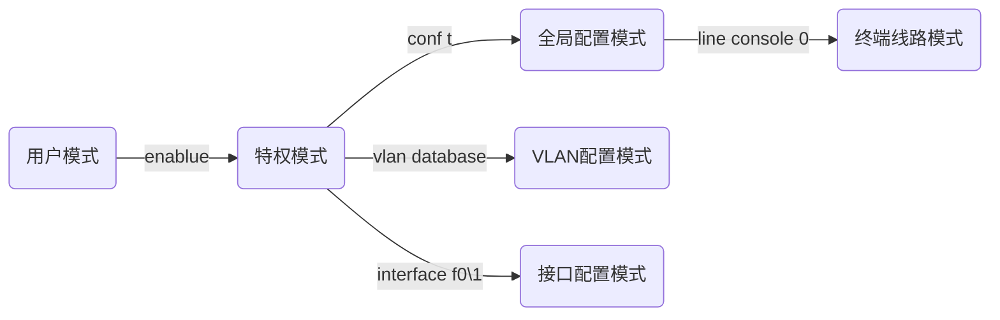

# 第一章

## 接口

| 名称      | 功能         |
| --------- | ------------ |
| console口 | 配置口       |
| RS-232    | 串口通信接口 |

## 线缆

### 直连线（直通线）

两端线序相同，同为568A或568B

### 交叉线

两端接线方法相异，一端为568A另一端为568B

### 线缆的选择

根据引脚定义选择，例如个人电脑使用引脚1、2发送数据，集线器使用引脚1、2接受数据，选择直通线

|    设备    | 引脚1、2定义 |
| :--------: | :----------: |
|    电脑    |     发送     |
|   路由器   |     发送     |
| 无线接入点 |     发送     |
|   集线器   |     接收     |
|   交换机   |     接收     |

| 设备1                  | 设备2                | 线缆选择 |
| ---------------------- | -------------------- | -------- |
| 电脑                   | 集线器               | 直通线   |
| 集线器、交换机uplink口 | 交换机、集线器普通口 | 直通线   |
| 集线器、交换机         | 路由器LAN口          | 直通线   |
| 电脑                   | 电脑                 | 交叉线   |
| 集线器、交换机普通口   | 集线器、交换机普通口 | 交叉线   |
| 路由器LAN口            | 路由器LAN口          | 交叉线   |
| 路由器WAN口            | 电脑                 | 交叉线   |

总结：看两端对引脚1、2定义，两端同为发或收时使用交叉线

### Packet tracer线缆两端灯亮点的含义

| 颜色   | 含义                                        |
| ------ | ------------------------------------------- |
| 绿色   | 物理连接准备就绪，还没有Line Protocol的指示 |
| 绿色闪 | 连接激活                                    |
| 红色   | 物理连接不通，没有信号                      |
| 黄色   | 交换机端口处于“阻塞”状态                    |

### DCE和DTE

线缆一样，根据名字定义先点的是什么，例如DCE线缆先点的是DCE

## 自定义模块

| 名称            | 作用                                                         |
| --------------- | ------------------------------------------------------------ |
| Linksys-WMP300N | 提供2.4GCHZ无线接口用于连接无线网络，支持采用以太网方式的LAN接入协议 |
| PT-HOST-NM-1AM  | 提供2个RJ-11连接器，以满足基本电话服务链接需要               |
| PT-HOST-NM-1CE  | 提供一个以太网端口，该端口可以连接一个局域网核心             |
| PT-HOST-NM-1CFE | 提供一个支持铜介质的快速以太网接口                           |
| PT-HOST-NM-1CGE | 提供一个支持铜介质的1000兆以太网接口                         |
| PT-HOST-NM-1FFE | 提供一个快速以太网接口，介质是光纤                           |
| PT-HOST-NM-1FGE | 提供千兆光纤连接用于连接路由器                               |
| PT-HOST-NM-1W   | 提供一个2.4GHZ无线接口用于连接无线网络，支持采用以太网方式的 LAN接入协议 |
| PT-HOST-NM-1W-A | 提供一个5GHz的无线接口,用于连接到无线802.11a网络             |

## DTE和DCE

DCE（数据通信设备或者数据电路终端设备）：该设备和其与通信网络的连接构成了网络终端的用户网络接口。它提供了到网络的一条物理连接、转发业务量，并且提供了一个用于同步DCE设备和DTE设备之间数据传输的时钟信号。调制解调器和接口卡都是DCE设备的例子。

DTE（数据终端设备）：指的是位于用户网络接口用户端的设备，它能够作为信源、信宿或同时为二者。数据终端设备通过数据通信设备（例如，调制解调器）连接到一个数据网络上，并且通常使用数据通信设备产生的时钟信号。数据终端设备包括计算机、协议翻译器以及多路分解器等设备。

## 交换机

| 名称      | 功能                                           |
| --------- | ---------------------------------------------- |
| 2950-24   | 24口交换机，二层交换机                         |
| 3560-24PS | 三层交换机，可以转发数据包，拥有部分路由器功能 |
| 网桥      | 中续                                           |

# 第二章

## 四种配置方法

* 基于CLI 
* 基于Console
* 基于Config窗口
* 基于Telnet

## 交换机命令

*** *[]表示为参数***

| 命令 | 模式   | 作用                         |
| ---- | ------ | ---------------------------- |
| ?    | 无要求 | 查看能够使用的命令或补全建议 |
| show | 无要求 | 输出信息                     |
| exit | 无要求 | 退出当前模式                 |

## 工作模式

用户模式: Switch>

特权模式: Switch#

全局配置模式: Switch(config)#

接口模式: Switch(config-if)#

VLAN模式: Switch(vlan)#

终端线路模式: Switch(config-line)#

## 命令

### 用户模式 Switch>

| 命令   | 说明         |
| ------ | ------------ |
| enable | 进入特权模式 |

### 特权模式  Switch#

| 命令                | 说明                                               |
| ------------------- | -------------------------------------------------- |
| configure terminal  | 进入全局配置模式                                   |
| vlan database       | 配置VLAN配置模式                                   |
| interface f0\1      | 进入f0\1的接口配置模式                             |
| interface vlan 1    | 进入vlan的接口配置模式                             |
| show vlan           | 输出vlan列表                                       |
| show running-config | 查看当前的运行配置文件，可以查看password设置的密码 |

### 接口模式  Switch(config-if)#

| 命令                                 | 说明                     |
| ------------------------------------ | ------------------------ |
| ip address 192.168.1.2 255.255.255.0 | 配置接口IP地址和子网掩码 |
| shutdown                             | 关闭接口                 |
| no shutdown                          | 启用接口                 |
| duplex [full/half/auto]              | 设为全双工/半双工/自动   |
| speed [10/100]                       | 设置速度为10M/100M       |

### 全局配置模式 Switch(config)#

| 命令                           | 说明                                   |
| ------------------------------ | -------------------------------------- |
| no ip domain-lookup            | 禁用域名解析服务                       |
| ip domain-lookup               | 启用域名解析服务                       |
| enable password [pw]           | 设置一个明文密码，可以在配置文件中看到 |
| enable secret [pw]             | 设置一个加密密码，优先级比password高   |
| ip default-gateway 192.168.0.1 | 设置默认网关                           |
| hostname                       | 更改名称                               |
| no hostname                    | 恢复默认名称                           |
| line console [ID]              | 终端线路模式                           |

### VLAN配置模式 Switch(vlan)#

| 命令                  | 说明                           |
| --------------------- | ------------------------------ |
| vlan [id] name [name] | 创建一个编号为[ID]名称为[name] |
| no vlan [id]          | 删除编号为[ID]的vlan           |

### 终端线路模式 Switch(config-line)#

