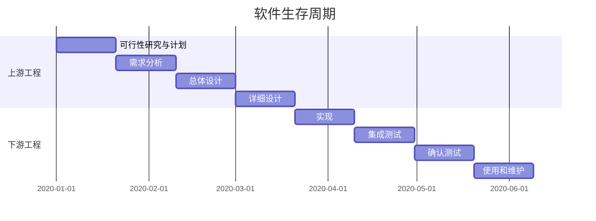

## 软件生存周期

软件产品或软件系统从设计、投入使用到被淘汰的全过程。

### 可行性分析与计划

​		该阶段的主要任务时对问题求解进行定义，对问题可行性进行分析，对待开发项目进行论证，最终决定该项目的开发价值，制定软件项目计划。

​		项目计划中包含的内容应对项目开发所需要的资源，费用等开发成本进行估算，设计项目开发方案，安排时间进度，综合以上各因素，对该项目的可行性进行分析，给出可行性分析报告。

### 需求分析

​		是开发人员经过深入细致的调研和分析，准确理解用户和项目的功能、性能、可靠性等具体要求，将用户非形式的需求转述转化为完整的需求定义，从而确定系统必须做什么、系统必须具备哪些功能，在此阶段给出 **软件需求说明书** ，还要依据可行性报告中制定的项目计划给出测试的要求与计划等。

### 总体设计

​		开发人员要把确定的各项功能需求，转换成需要的体系结构。在该体系结构中每个成分都是意义明确的模块，即每个模块都和某些功能需求相对应，规划各个体系结构之间的关系依赖，在此阶段给出 **概要设计规格说明书**、**数据设计说明书**、**测试计划**

### 详细设计

​		就是为每个模块完整的功能进行具体描述，要把功能描述转变为准确的结构化的过程描述，在此阶段给出**详细设计说明书**

### 实现(编码)

​		编码阶段就是把每个模块的控制转换成计算机可接受的程序代码，即嗯写成以某特定程序设计语言表示的 **源程序清单**

### 测试

​		软件测试阶段就是利用测试工具按照测试计划和流程对产品进行功能测试和性能测试，其主要方式是在设计测试用例和的基础之上检验软件的各个组成部分。该阶段给出 **测试分析报告**

**测试规划**

| 名称             | 作用                                                         |
| ---------------- | ------------------------------------------------------------ |
| 模块(单元)测试   | 查找各模块在功能和结构上存在的问题                           |
| 组装（集成测试） | 将各模块按一定顺序组装起来进行的测试，主要是查找各模块之间接口上存在的问题 |
| 确认测试         | 按说明书上的功能逐项进行的，发现不满足用户需求的问题，决定开发的软件是否合格、能否交付用户使用 |
| 系统测试         | 在运行环境下对软件进行恢复测试、安全测试、压力测试           |

### 维护

​		软件维护是软件生存周期中时间最长的阶段。已交付的软件投入正式使用后，便进入软件维护阶段，它可以持续几年甚至几十年。软件运行过程中可能由于各方面的原因，需要对它进行修改

原因：

* 软件有错误需要修改

* 适应软件工作环境进行变更

* 对用户需求需扩充和增强软件功能

* 针对技术变革做适应性维护

​																								      		*2022.3.18 19计科1 宋祺睿 01926026*
